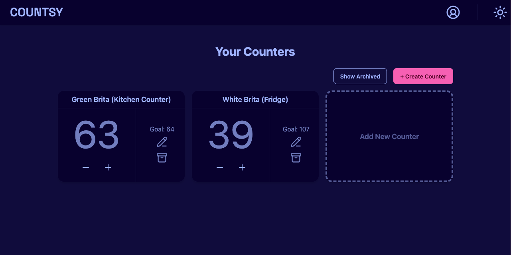

# Countsy

_Track anything. Count everything._

🔗 **[Live Demo](https://countsy.cisocodes.com)**

Countsy is a lightweight web app that lets you create and manage custom counters for anything you want — habits, projects, inventory, goals, and more.

Whether you’re tracking water intake, completed tasks, or inventory stock, Countsy keeps your tallies organized and accessible.

Built with **React**, **DaisyUI**, **Supabase**, and **Lucide**, Countsy offers a clean, fast, and mobile-friendly experience.

---

## ✨ Motivation

This project began as an experiment: take the most ubiquitous coding example — a counter — and build something full-featured and production-ready out of it. Along the way, I wanted to deepen my experience with **Supabase**, learn to implement modern **authentication flows**, and explore best practices in component design, state management, and database structure.

The idea was simple: prove that even a humble counter app can be thoughtful, elegant, and technically instructive.

---

## 🛠️ Tech Stack

- **Frontend:** [React](https://reactjs.org), [Vite](https://vitejs.dev), [TypeScript](https://www.typescriptlang.org)
- **UI:** [Tailwind CSS](https://tailwindcss.com), [DaisyUI](https://daisyui.com), [Lucide Icons](https://lucide.dev)
- **Backend-as-a-Service:** [Supabase](https://supabase.com)
  - Auth (email + Google login)
  - Realtime Database (PostgreSQL + Row Level Security)
- **Hosting:** [Vercel](https://vercel.com)

---

## 🚀 Features

- Create multiple named counters
- Inline editing for counter titles
- Optional goals per counter
- Increment/decrement counters
- Archive and unarchive counters
- Responsive UI for mobile & desktop
- Email and Google authentication
- Secure, per-user data isolation via Supabase RLS

---

## 📄 License

This project is licensed under the [MIT License](./LICENSE.md).
