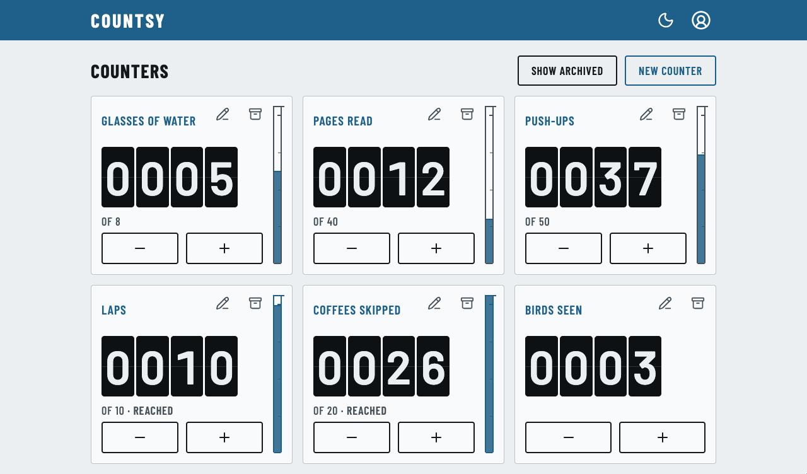
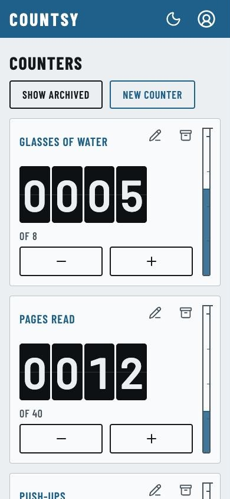

# Countsy

_Track anything. Count everything._

**[Live demo](https://countsy.cisocodes.com)**

<picture>
  <source media="(prefers-color-scheme: dark)" srcset="./docs/screenshots/counters-dark.jpg">
  
</picture>

Countsy is a small web app for keeping named counters: glasses of water, finished chapters, boxes left in the stockroom. Each counter has a title, a current value and an optional goal. Sign in and your counters follow you across devices.

## Why I built it

A counter is the first example in every React tutorial. I wanted to see how far one could go if I treated it as a real product: real authentication, a real database with per-user access rules, and the unglamorous parts like loading states, failed requests and form validation. It was also a way to get comfortable with Supabase and to practice structuring a small app so that it stays easy to change.

## Features

- Create as many counters as you like
- Increment and decrement from the counter card; the number changes immediately and rolls back if the save fails
- Rename a counter in place, or open the edit page to change its title, value and goal
- Set an optional goal per counter; a measuring glass on the card fills toward it and tops out at the brim when you reach it
- Archive a counter, hide archived ones, and restore them later
- Sign in with a magic link sent to your email, or with Google
- Each user can only read and change their own counters, enforced by Postgres row level security
- Works on phones and desktops, with light and dark themes that follow your system setting



## Design

The look is borrowed from a water meter: each value sits in a row of drum tiles under a single meter-blue plate, on a flat enamel-grey ground with no gradients or shadows. Motion only acknowledges an action, and reaching a goal is shown by the glass filling to its brim. The full system (colors, type, components and the reasoning behind them) is in [DESIGN.md](./DESIGN.md).

## Tech stack

| Area    | Tools                                                                      |
| ------- | -------------------------------------------------------------------------- |
| App     | React 19 with the React Compiler, TypeScript, Vite, React Router           |
| Data    | TanStack Query for fetching, caching and optimistic updates                |
| Forms   | React Hook Form with Zod schemas                                           |
| UI      | Tailwind CSS 4, Barlow and Barlow Condensed, Lucide icons, react-hot-toast |
| Backend | Supabase (Postgres with row level security, Auth with PKCE flow)           |
| Hosting | Vercel                                                                     |

## Getting started

You need Node.js, [pnpm](https://pnpm.io) and a free [Supabase](https://supabase.com) project.

1. Install dependencies:

   ```sh
   pnpm install
   ```

2. Create a `.env.local` file with your project's URL and publishable key (Project Settings, then API):

   ```sh
   VITE_SUPABASE_URL=https://your-project.supabase.co
   VITE_SUPABASE_PUBLISHABLE_KEY=your-publishable-key
   ```

3. Create the `counters` table and its access rules in the Supabase SQL editor. The columns match [src/types/supabase.ts](src/types/supabase.ts):

   ```sql
   create table public.counters (
     id uuid primary key default gen_random_uuid(),
     user_id uuid default auth.uid() references auth.users (id) on delete cascade,
     title text not null default '',
     value integer not null default 0,
     goal integer,
     is_archived boolean default false,
     created_at timestamptz not null default now(),
     updated_at timestamptz default now()
   );

   alter table public.counters enable row level security;

   create policy "Users manage their own counters"
     on public.counters
     for all
     to authenticated
     using (user_id = auth.uid())
     with check (user_id = auth.uid());

   create function public.set_updated_at()
   returns trigger
   language plpgsql
   set search_path = ''
   as $$
   begin
     new.updated_at = now();
     return new;
   end;
   $$;

   create trigger set_updated_at
     before update on public.counters
     for each row execute function public.set_updated_at();
   ```

4. In Authentication settings, add `http://localhost:5173/auth/callback` to the allowed redirect URLs. When you deploy, set the Site URL to your production address and add its `/auth/callback` as well. To use Google sign-in, enable the Google provider with your own OAuth credentials.

5. Start the dev server:

   ```sh
   pnpm dev
   ```

Other scripts: `pnpm build` type-checks and builds for production, `pnpm lint` runs ESLint, and `pnpm preview` serves the production build locally.

## License

Released under the [MIT License](./LICENSE.md).
